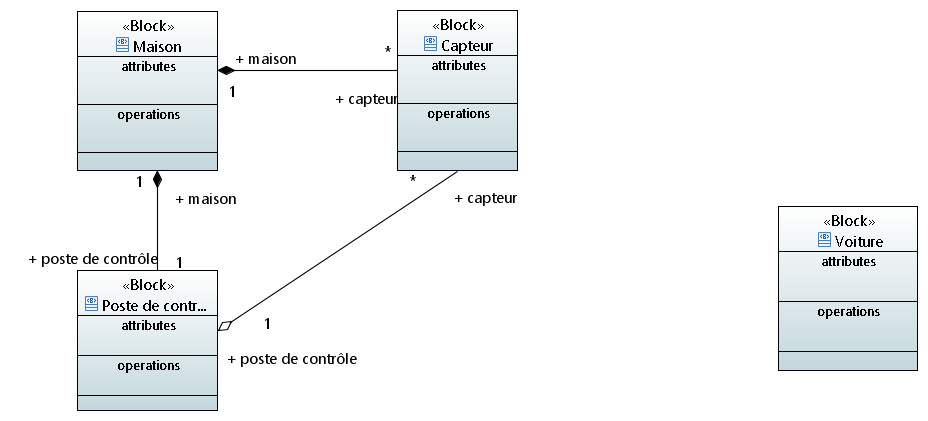

Groupe Model : GLORIES Ancelin  CESCHIN Quentin

# RequirementEngineeringExperimentations

Dans ce read me vous trouverez les différents diagrammes modélisant les exigences de ce projet

## Le digramme des cas d'utilisations

### Définition des acteurs : 
	
	* la maison --> affiche
	* un humain --> lit

## Le diagramme de définition de blocs

## Le diagramme de blocs internes 

