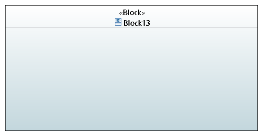

Groupe Model : GLORIES Ancelin  CESCHIN Quentin

# RequirementEngineeringExperimentations

Dans ce read me vous trouverez les différents diagrammes modélisant les exigences de ce projet.
Par rapport aux exigences, nous allons ajouter un scénario d'utilisation : l'utlisateur souhaite se déplacer en voiture tous les jours à 16h30. 

## Le digramme des cas d'utilisations

### Définition des acteurs : 

## Le diagramme de définition de blocs

## Le diagramme de blocs internes 

